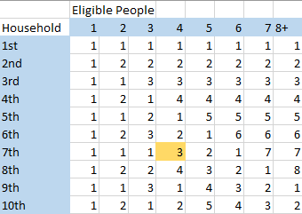
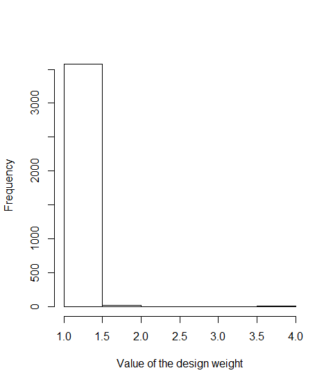
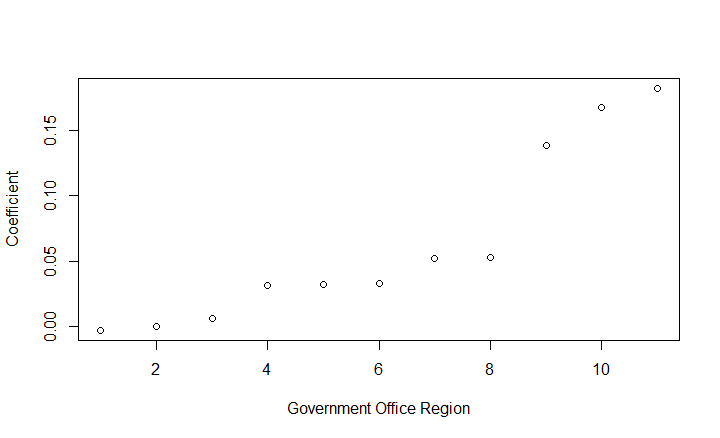
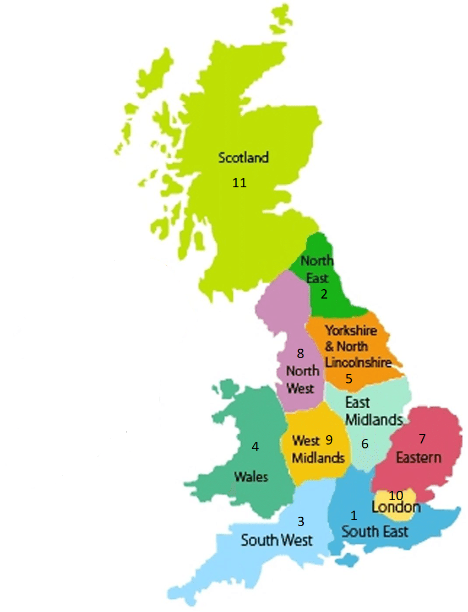
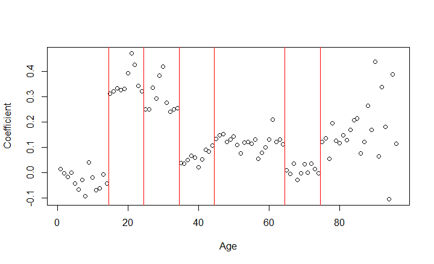
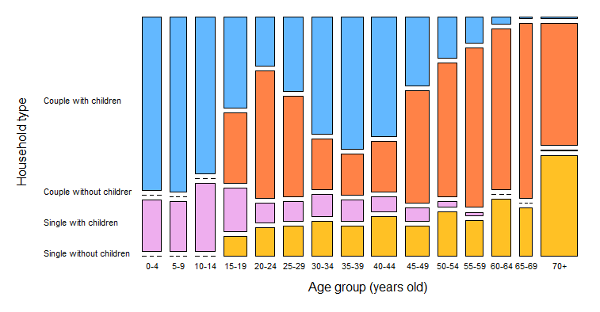

```{r include=FALSE}
society <- readRDS("Understanding Society innovation pnel wave A.RDS")
society$a_dvage <- as.numeric(society$a_dvage)
```


# Introduction

To estimate population quantities from sample data, broadly two strategies can be employed: model-based inference and design-based inference (Lohr, 2010). In this technical report, the effect of the latter on population estimates is investigated, by means of analyzing a single wave of Great Britain's  multi-year panel study 'Understanding Society'. This annual household panel survey is used to assess topics like housing, education, health, and employment among the general population of the United Kingdom. More specifically, we focus on the a subset of first wave, conducted between 2008 and 2009: the 'Innovation Panel' (IP). 

The purpose of the IP was to enable methodological research, before initiating the main 'Understanding Society' survey. As a forerunner, the target sample size of the IP was 1500 households across Great Britain, whereas the intended sample size for the main survey was 40,000 households within the United Kingdom (Boreham, & Constantine, 2008). Therefore, the sampling frame of the IP, The Postcode Address File, encompassing England, Wales and Scotland. Other regions of the United Kingdom like Northern Ireland were not part of the target population.
	
To obtain the sample from the sampling frame, multistage stratified cluster sampling was used. Postal sectors acted as primary sampling units (PSUs) in the cluster design, and were sorted by Government Office Region. Within these regions, strata were constructed based on a.o. non-manual occupations, ethnic minority density, and population density. After stratification, a sample was drawn from the  sampling frame (the Postcode Address File), with probabilities proportional to the number of postal delivery points within each postcode sector (the stratified PSUs). Per postcode sector, 23 addresses were selected, yielding a total of 2760 addresses. However, interviews were only achieved in 1489 households (Boreham, & Constantine, 2008). This discrepancy -- the sampling, non-sampling, and nonresponse errors -- is one of the main topics that is investigated in the current research project.

The aim of this research project is to investigate several properties of the IP data, with respect to the sampling procedure, the use of weights in survey data analysis, and to estimate population quantities from the sample. The report is based on eight research questions (RQs) that were provided in the research proposal (Appendix I: Research Proposal). The RQs are structured according to three topics; Part I: Sampling, Part II: Weighting, and Part III: Estimation. In the sampling part, we investigate how within-household selection of respondents was performed (RQ1), and how many people within the sample personally conducted an interview (RQ6). The part concerning survey weights encompasses a theoretical explanation for the variation between design weights across observations (RQ2), computation of enumerated weights (RQ3), and an effort to suggest variables that could be used to construct nonresponse weights (RQ8). Finally, in the third part population quantities are estimated: the relationship between age and household composition (RQ5), and the proportion of employed people of working age in the population with and without accounting for nonresponse (RQ4 and RQ7, respectively). The exact formulation of the research questions can be found in Appendix I: Research Proposal.

# Methods

The data in this research project was obtained by 'The National Centre for Social Research' from the United Kingdom (Boreham, & Constantine, 2008, p. 3), and retrieved via Dr. Peter Lugtig (Utrecht University). Data analysis is performed using the statistics freeware R (R Core Team, 2003). Preprocessing of the data consisted of removing variables irrelevant to the current study from the dataframe and subtracting 6 years from the variable 'a_dvage' so it correctly reflects the age of each person at the time of the first wave rather than the average age over all waves (see Appendix II: R Script). Additional preprocessing was done for RQ8 specifically. The details of this are described under this question's section.

To obtain accurate estimates from survey data with a multistage sampling design, regular SRS estimators do not suffice (Lohr, 2010). Therefore, the R package 'survey' (Lumley, 2018) is used. By specifying the survey design and appropriate weights, estimates of population quantities and their variances are adjusted for the complex nature of the survey data. The survey package functions 'svydesign', 'svymean', and 'svychisq' are employed to estimate population quantities. To investigate the relationship between age and household_type, the survey package function 'svytable' was used. 

Moreover, stepwise logistic regression is performed to investigate which variables might be used to construct nonresponse weights. This exploratory analysis is conducted using the R package 'MASS' (Venables, & Ripley, 2002).


# Results

## Part I: Sampling

### Within-household selection of respondents (RQ1)

For the Understanding Society study, up to three households per dwelling and up to three people per household were selected for interviews. If more than three households were found at a single dwelling, or if a single household contained more than three people, the Kish Grid method was used to select households or people at random.

This method considered to lead to a random sample of household members, and avoids selection bias in the survey. When using the Kish Grid method, the researcher has to list all eligible household members and assign each of them a number i. The Kish Grid then helps you pick a random person i within the n^th^ household you're investigating, see Figure 1. 


 

It is a popular method because when carried out correctly, it leads to (almost) equal probability sampling, something other selection methods do not obtain (Kumar, 2014).  This is because of the way the grid is set up, each household member has an equal chance of being selected.  Moreover, the only information you need in order to select respondents is a list containing the names of the persons in the household you want to sample, because selection is based on the number you've assigned to them. Other selection methods usually need more information, like the date of birth of the household members.


### Proportion of personal interviews within the sample (RQ6)

Within the data, there is a proportion of sample members that did not personally take part in an interview, potentially leading to nonresponse bias. However, not all of these observations count as nonresponse. Of the 3600 individuals in the sample, there are 459 children under the age of ten. These sample members are enumerated individuals, but ineligible for an interview. Accordingly, the number of eligible individuals in the sample is 3141. Of these 3141 eligible individuals, only 2656 respondents personally completed an interview. This number consists of 2399 adults who performed a full interview and 257 interviews with children. Taken together, 485 cases of (partial) unit nonresponse exist within the subset of eligible individuals.

Moreover, there are 169 sample members for whom a proxy interview was conducted with a close relative or cohabitant (generally a spouse, partner or adult child; Understanding Society, 'Questions about variables', N.D.). Questions answered on the nonresponders' behalf were used to estimate factual information about the nonrespondent -- information about their beliefs is not collected by proxy, and are therefore indicated as missing (item nonresponse). In the current dataset, no variables about beliefs or opinions of respondents are included, leading to a lower nonresponse rate, but potentially higher nonresponse bias when proxy interview data is used to compensate partial nonresponse. 

Since (partial) nonresponse can lead to nonresponse bias, it is important to investigate the effect of nonresponse on the estimates generated above. Ideally, we would both compare respondents to partial nonresponse and unit nonresponse. Because of time constraints within this research project, we only investigate how weights may be constructed to adjust for unit nonresponse (see Part III: Estimation).


## Part II: Weighting

### Variation in design weights (RQ2)

Following from the sampling design, all sample members were assigned a design weight. As Table 1 shows, the variance in the design weight variable is `r round(var(society$a_psnenip_xd),2)`. With a mean of `r round(mean(society$a_psnenip_xd), 2)`, the coefficient of variation is only `r round(sqrt(var(society$a_psnenip_xd))/mean(society$a_psnenip_xd), 2)`. 

Table 1. *Descriptive statistics of design weight variable 'a_psnenip_xd'*.

Mean | SD | Min. | Max. 
------------- | ------------- | ------------- | ------------- 
1.01 | 0.14 | 1.00 | 4.00 

The low variance within the design weight variable can be due to rescaling of the weights, as explained in the IP User Guide (p. 56): "Each set of weights has been scaled by a constant factor to produce a mean of one amongst cases eligible to receive the weight". That is, the design weights are standardized on one. This procedure does, however, not affect the coefficient of variation.

Moreover, the maximum value of this variable suggests trimming of weights greater than 4. Trimming, truncating, or smoothing of weights are techniques to inhibit the effect of a single observation on population estimates and its variance. Trimming may yield biased estimates, but is shown to decrease the mean square error (MSE; Lohr, 2010). It is therefore reasonable to assume that weight trimming was performed within the current dataset.

A histogram of the design weight variable (see Figure 2) shows a different reason for the low variance: all but 26 respondents have a design weight of exactly 1. This can be attributed to the sampling design, in which, among other things, popluation density within PSUs was used to construct strata. With that, inclusion probabilities of households were roughly equal within strata. The resulting design weights thus represent the discrepancy between the number of observation units in the population, and the proporion of households per stratum selected from the sampling frame. 




### Computation of enumerated weights (RQ3)

Apart from design weights, each respondent is also assigned an enumerated weight (the variable 'a_psnenip_xw'). This weight was the design weights post-stratified for sex, age and government office region. In the innovation panel study, population values were retrieved from the UK government and the weights were adjusted based on the differences between the sample proportions and these population values. These population values could not be obtained for the current study due to the data not being available to the general public. Another hurdle that had to be overcome was that age and government office region were grouped into respectively seven and four groups (IP User Guide, p.57), but no information was given on how these groups were constructed. An attempt was made to reconstruct these groups using linear regression.

The first step taken was to construct a linear model that contained the design weights, sex, age (numeric, 'a_dvage') and the government office regions (GOR):

$$ Weight_{adjusted} \sim Weight_{design} + Sex + Age + GOR$$


To find the grouping of government office regions, the coefficients that resulted from this regression, including the baseline, were ordered from lowest to highest, which resulted in the following graph:



While there are clear groupings in the graph, they do not divide the data into four groups. To be able to investigate the data from a theoretical point of view, the numbers were drawn into a map of the regions, as shown below.

 

The three government office regions with high weights are Scotland, London and the West Midlands. Scotland and London are prime candidates to be categories of their own, as Scotland has a strong regional identity and London is the capital of the country. From a data-driven perspective, combining the West Midlands with any region other than London or Scotland does not make sense, as the weight difference between those region and all other regions is relatively big. From a theory-driven perspective, we cannot think of any good reason to combine the West Midlands with London or Scotland: it is not filled with cities nor is it close enough to Scotland to assume a similar population. 

When assuming that the regions with near identical weights are in the same group and Scotland and London each form one group on their own, the division between groups that makes most sense is that London, Scotland and the West Midlands are each categories of their own and Wales and the rest of England form the last group. Any other combination is unlikely due to inconsistencies with the found coefficients or with the theoretical background: any other combination would either require the grouping of the West Midlands with regions with a far lower weights, or would require London to be combined with Scotland or the West Midlands, which have very different demographics.

To find the age groups, a new variable for grouped government office region was created, divided into the groups described above. A factor-version of the 'a_dvage' variable was also created in order to obtain the coefficients per age. A second linear regression was run similar to the previous one, but with the grouped GOR and factored age replacing the previously used age and GOR variables. The resulting graph, shown below, was used to split the age category into seven groups. In the graph, these groups are depicted with red lines.



These categories make sense both in theory and weight-wise (see Figure 3). Children are grouped together (0-14), as are teens and students (15-24). Adults are divided in three categories (25-34, 35-44, 45-64) and the elderly in two (65-74, 75+).

As a final step, a third linear regression analysis, with age grouped into the groups described above, was done to find out which groups had the highest weights and were thus underrepresented in the sample.

Females have slightly lower weights than males, indicating that they were overrepresented. For government office region groups, the people from England (excluding London and the West Midlands) and Wales are the baseline and have the lowest of all weight, and thus were also overrepresented, with Scotland being the most underrepresented, followed by London and then the West Midlands. With regards to age, the 0-14 group was surprisingly the most overrepresented. The 21-30 and 31-40 groups were the most underrepresented and thus had the highest weights, followed by the 80+ group, the 51-70 group, the 41-50 group and finally the 71-80 group, which was by far the most underrepresented.

### Construction of nonresponse weights (RQ8)

Nonresponse can seriously threat the quality of estimates if the nonresponders differ from the responders in the study. We can adjust for this by the use of auxiliary variables that hold information about the entire sample. We can compare the distribution of the auxiliary variables of the population with its response distribution, and assess whether the response distribution is representative for the whole population. 

If the distributions differ, we must conclude that nonresponse has lead to a nonrepresentative sample. We can adjust for this by constructing nonresponse weights from the auxiliary variables. Then the weighted sample is representative with respect to the auxiliary variables used. Different choices of auxiliary variables lead to different weights. In order to the weights to be useful, it is important to use powerful auxiliary variables (Brick, 2013).

The IP User Guide states that "all models used to predict response propensities as described in the Technical Details are fitted using stepwise backward logistic regression with p=0.05" (p. 56). Compared to other selection strategies, this is a fairly simple one. Considering these other strategies for selecting auxiliary variables for weighting adjustments for nonresponse, we advise to look into Schouten's (2007) proposed strategy of a forward inclusion-backward elimination algorithm and/or Saarndal and Lundstrom's (2010) paper.  	We opt for a stepwise backwards logistic regression of because this method is similiar to, yet easier to apply than the selection strategies described in Schouten (2007) Saarndal and Lundstrom's (2010). Most important, this selection strategy was also used in constructing the original weights in the dataset. With this method, we hope to identify variables that predict nonresponse. 

There are two stages of nonresponse we would have wanted to consider: 
* person nonresponse: whether a personal interview was conducted yes or no;
* household nonresponse: defined as completian of at least the household grid.

However, as the levels of variable 'a_hhresp_dv' show, all households within the sample completed at least the household grid. We do not have any information about the 1271 adresses that were selected from the sampling frame but did not take part in an interview. Therefore, we only account for individual unit nonresponse, which occurred in 26.2% of the observations in the sample.

The forwards stepwise logistic regression model shows us that the variables 'a_racel_dv', 'a_agegr5_dv', 'a_agegr13_dv', 'hh_size', 'a_sex', and 'a_urban_dv' are useful in predicting nonresponse. That is, a linear combination of variables indicating race, sex, and age of respondents in combination with living situation (urban or rural area, and household size) yield a significant prediction of the logit of the nonresponse indicator. A backward stepwise analysis also indicated the variables household type (hh_type) and government office region (a_gor_dv) could explain some additional variance in nonresponse. The variables 'a_employ', 'a_agegr10_dv', and 'n_child' were not included in the model based on the statistical decision criteria used in the stepwise logistic regression analysis. 

Importantly, since this type of analysis is exploratory, no inferences will be drawn from these results. **The predictive accuracy of the stepwise model is ..., where for the full model this was ..**
    
We investigate the most important predictors individually: 
>>> plot relationships (I did a few analyses in the finalcode file but since the model isn't definitive I didn't write up any concluding remarks about them yet)

## Part III: Estimation

### Relationship between age and household composition (RQ5)
To investigate the relationship between age and household composition, three steps were performed: choosing which age variable would be used, constructing a new variable to represent household composition, and including the appropriate weight in the analysis. 

Firstly, we investigated which variable to choose representing the age of respondents. There are four variables in the data expressing the age of respondents: a_agegr5_dv, a_agegr10_dv, a_agegr13_dv, a_dvage. The first three are categorical varibles, divided into groups as seen in the UK Labour Force Survey. The fourth variable, a_dvage, is continuous. 

The first categorical variable, a_agegr5_dv, contains 15 categories indicating age in five-year partitions up to '70 years or older'. The variable a_agegr10_dv is highly similar, indicating age in ten-year intervals, and consisting of 8 different categories between ages zero and seventy-plus. Finally, a_agegr13_dv consists 13 levels, with unequal age intervals under the age of 20 (namely 0-15, 16-17, and 18-19 years old), five-year intervals between the ages 20 and 64, and a sigle interval containing all ages from 65 years old upward. 

The continous variable a_dvage denotes the age of respondents in completed years at the moment the interview took place. This was computed by comparing the date of birth and the interview date, or using an estimate (see estimated age variable a_ageest (n = 22), and imputated age variable a_ageif (n = 55)).

To investigate the relationship between age and household composition, it is necessary to know which households consist of children living at home, and which don't. Presumably, the largest variation between children living at home and those living independently occurs within the age group 15-25 year-olds. If we would use the ten-year intervals to indicate age, we might get less precise estimates, because of the large variance wihtin the age category '10-19 years old'. Therefore, we decided to use an age variable with smaller intervals. Because of the unequal intervals in the age variable with 13 categories, it should be analysed as ordinal variable. To interpret the relationship with household composition, this is not ideal. Ultimately, we decided to use agegr5_dv, which is categorical and allows us for contingency tables and nice graphical representations. 

Secondly, to construct a new variable denoting household composition, we used Eurostat as reference. Eurostat distinghuishes three types of variables used to descripte household composition: 

* Household size;

* Number of children;

* Household type, with levels: couple (with/without children), single adult (with/without children), other type of household (with/without children).

All three household composition indicators were constructed from the data and included per household into a household composition matrix (see Appendix II: R Script). 

Thirdly, we determided which weighting variable is appropriate to investigate the relationship between age and household composition. Many different weights are available for the dataset, each with a different combination of target population, instrument, wave, and weight type. In this study only data from the first wave was used, so a cross-sectional weight for the first wave (IP) should be used. There are two versions of the cross-sectional weight: the design weight and the adjusted weight. As our goal is to estimate population values rather than sample values, the cross-sectional adjusted weight (XW) is appropriate here. The variables of interest in this case are age and several variables containing household information. As age and all relevant household information is known for all sampled individuals, including those that were not interviewed, the method used to obtain the required information is in all likelihood the enumeration grid (EN). Household information is the same for all people within one household, but age is a feature of an individual. The average age per household should not be used,  as the variance within one household can be high, especially when multiple generations live in one household, and taking the average would thus lead to information loss. Finally, as both children and adults are of interest for this question, a weight that includes all individuals in the sample should be used rather than one that includes only children or only adults (PSN). Thus, the weight appropriate for solving this question is a_psnenip_xw, which is the cross-sectional adjusted weight per individuals for the variables in wave 1 that are obtained through the enumeration grid. 

Our objective was to investigate the relationsihp between age and household composition. We therefore plotted the composition of variable hh_type per age category (from a_agegr5_dv). The plot shows the relationships between household_type and age you'd expect, from which we will highlight a few: 



* Persons in the youngest three age categories (0-4, 5-9 and 10-14 years old) where all members of either households of type "couple with children", or "single parent with children", obviously. 
* The reverse pattern is found in the eldest age categories, where almost all persons are in a household of type "couple without children" or "single without children". 
* There are also a few interesting developments of categories over age. 
** As age increases, overall the occurence of households with children (pink and blue colored bars) declines. 
** Looking at household type "couple with children", the transition from being child in such a household and becoming a parent shows from the decline and subsequent increase of occurences of this householdtype over age. 
** Similarly, also the transition from living in  a household with no children to living in a household with children, to an "empty nest" is visible by the development of the orange bars (couple without children) and the blue bars (couple with children). This is also true for the yellow and pink bars (single without chldren and single parent with children)

These are obviously just general observations, further statistical investigation is required if there are more specific research questions. Therefore we created a new age variable in which all household types were represented within an age group (see Appendix II: R Code). With this new variable, we performed a Chi square test of independence to evaluate the statistical relationship between age and household type. It appeares that age and household type are not independent within the current sample; $\chi^2$(30) = 1763.1, *p* < .001. This result strongly suggests that age and household type are related in the population.


### Proportion of employed people of working age (RQ4)

Another point of interest of this study was the proportion of employed people of working age in the population. To calculate this, a new variable named employ_dv was created which was true for all employed people within the age range of 15-64 and false for all others. Next, a design was made using the svydesign function of the svy package, with the household identifiers ('a_hidp') as cluster identifiers, the given strata ('a_strata') as strata and the adjusted weight 'a_psnenip_xw' as weight. It was found during the investigation of the variables that there were two individuals with a missing value for employment. These were included in the initial design and then removed with the subset() function, as weights were calculated with these included. Finally, the proportion and its confidence interval were calculated using the svymean() and confint() functions.

The estimated proportion of employed people of working age is 46.2%, 95% CI[44.3%, 48.1%]

### Proportion of employed people of working age, accounting for nonresponse (RQ7)

The next step was to evaluate whether there is a difference in estimated proportion of employed adults between those who responded personally and the entire sample. To this end, a variable for nonresponse was created (RQ6) which was 1 in cases of (partial) nonresponse and by-proxy responses and 0 when a full (youth) interview was done. The design from RQ4 was then recreated to include this variable. On top of the individuals with missing values for employment, this time all nonresponders and partial responders were excluded using subset() and the new nonresponse variable. The proportion and confidence interval was then calculated once again.

When only the responders are taken into account, the estimated proportion of employed adults in the population is 50.4%, 95% CI[48.2%, 52.6%]. Compared to the estimated proportion calculated in RQ4, 46.2%, 95% CI[44.3%, 48.1%], the proportion estimated from the responders is far higher, to the point that there is no overlap in confidence intervals. This means that responders are more likely to be employed than non-responders. This, however, may be due to the 459 children under the age of ten that were included in the sample. No attempts were made to interview these children, which means they are considered missing data. As is logical, and confirmed by investigation of the employ_dv variable, none of them are employed. Thus, all 459 would be included in the analysis of RQ4 and excluded in the analysis of RQ7.

A third design was created to investigate this hypothesis, which excluded all children below the age of ten. This yielded a population estimate of 52.0%, 95% CI[50.0%, 54.1%], which is higher than the estimate made using only the information of the responders. This is a more logical result: unemployed are more likely to be home, and thus easier to reach for a personal interview.

# Discussion

In this report, nonresponse in the Innovation Panel study was investigated. To this end, we first investigated the sampling procedure and the prevalence of nonresponse, then the weights, and finally some population parameters were investigated.

We found that 459 children under the age of 10 were included in the sample, but ineligible for interviews. There were 485 cases of (partial) nonresponse and 169 cases of by-proxy response.**Conclusion Q8** Another finding was that employed people are less likely to respond, which leads to a lower estimation of the proportion of employed adults in the population when nonresponders are excluded. The investigation into the relation between age and household composition yielded a confirmation of what was to be expected, with the proportion of households with children dropping when kids become adults, rising again when they get kids of their own, and then dropping again as their children become adults.

There are some points of note in this report. As discussed in RQ3 under Part II, the calculation of the adjusted design weights was not replicable due to the population parameters being not publicly available and the grouping of variables being unknown. While an approximation could be made using linear models, there is no way to know how the adjusted weights were calculated except by asking the researchers involved in this study personally. One could argue that this is bad: research should be replicable. However, the population parameters can be considered sensitive data, and are not publicly accessable because government agencies haven't made it publicly accessible. As such, it may be unrealistic to expect the parameters. Describing the groups but not the parameters would be a middle road solution to this problem. It makes it slightly easier for those without access to the population parameters to estimate them, but also makes the calculations replicable for those who do have access to these parameters. 

Another point of interest is the issues with nonresponse shown in RQ7 in part III. This is an example of why one has to be very careful when assessing nonresponse. In RQ4, the population was defined as 'the entire population of Great Britain' (though technically homeless people were excluded due to the sampling design). In this case this is a logical action: we could have defined the population in another way, e.g. as all adults of working age, but the result is not meaningless: for example, it can be used to reflect how much financial weight each person is carrying, where in this case the estimation implies that every employed person on average has to provide for two people, be it through taxes or through buying clothes for your own kid. When assessing nonresponse however, this population becomes problematic: children under ten were ineligible for interviews and thus automatically fell into the nonreponse category. Comparing the resulting estimated proportion of employed responders with the estimated proportion of employed adults says more about the number of young children in the sample than the number of employment of responders. Thus, when assessing nonresponse, one always has to assess who is not responding and why.


\newpage


# References

Boreham, R., Constantine, R. (2008). Understanding Society Innovation Panel Wave 1: Technical Report. National Center for Social Research.

Eurostat. (2018). Household composition statistics [Explainer]. Retrieved via https://ec.europa.eu/eurostat/statistics-explained/pdfscache/29071.pdf.

Kumar, Rohit. (2014). Respondent Selection Methods in Household Surveys. Jharkhand Jounral of Development and Management Studies. XII. 5701-5708. 

Lohr, S. (2010). Sampling: Design and Analysis (second edition). Brooks/Cole, Boston, USA.

Lumley, T. (2018). Survey: analysis of complex survey samples [R package, version 3.34]. Retrieved via https://cran.r-project.org/web/packages/survey/.

R Core Team (2013). R: A language and environment for statistical computing. R Foundation for Statistical Computing, Vienna, Austria. Retrieved via http://www.R-project.org/.

Saarndal, C.E. and Lundstrom, S. (2010). Design for Estimation: Identifying Auxiliary vectors to reduce nonresponse bias. Survey Methodology, 36, 131'144.

Schouten, B. (2007). A Selection Strategy for Weighting Variables Under a Not-Missing- at-Random Assumption. Journal of Official Statistics, 23, 51'68.

Venables, W. N. & Ripley, B. D. (2002) Modern Applied Statistics with S. Fourth Edition. Springer, New York. ISBN 0-387-95457-0


\newpage

# Appendix I: Research Proposal

Understanding Society is a large, multi-year panel study of the population in the United Kingdom and Northern Ireland. The dataset that you will analyse is wave 1 of the Understanding Society Innovation Panel, which is used for testing instruments. The Innovation panel (IP) uses the same sampling procedure as the main Understanding Society Survey, apart from the fact that Northern Ireland is not included. Sampling is done using a multistage stratified cluster sample. For more information, see https://www.understandingsociety.ac.uk/sites/default/files/downloads/documentation/innovation-panel/user-guides/ip_user_guide.pdf 

Within this file, further references are made to the sampling and weighting guidelines. Do read these, because this will be important for the rest of the analyses. The data file you need for this assignment is 'understanding society innovation panel wave A.RDS'.

Questions for report:
(for questions 1-5), please ignore nonresponse errors.
1. The Innovation panel would interview multiple people from every household, but in the case households are very large, a Kish Grid is used. Can you explain why the Kish Grid is a popular method to do within-household selection of respondents?

2. Despite the complex data structure, the design weights as included in the variable 'a_psnenip_xd' have a very low variance. Can you explain why this is the case?

3. Apart from the design weight, an enumerated design weight 'a_psnenip_xw' is also included. Please show using syntax in R how you can calculate this weight.

4. What is the proportion of employed people of working age (15-64) in the population? (use variable 'a_employ')

5. Please investigate the relationship between age and household composition for the population of Great Britain. Take the following steps:

+ Investigate which age variable you should use (and whether choosing a particular age variable at all matters)

+ Construct a new variable 'household_composition' from the following four variables: 'a_livesp_dv, a_cohab_dv, a_single_dv, a_mastat_dv'. You may also use information from across household members to do this.

+ Which weight should you use here?
From here on, take nonresponse error into account.

6. Not all sample members you included in questions 1-5 participated in the survey. Use the variable 'a_ivfio' to investigate how many people personally conducted an interview.

7. Repeat your analysis under question 4. Use only the people who personally did an interview. What is your conclusion? Is there a difference between respondents and nonrespondents when it comes to their employment?

8. Using only variables from this dataset, can you find variables which could potentially be useful for constructing nonresponse weights? Why these variables?
